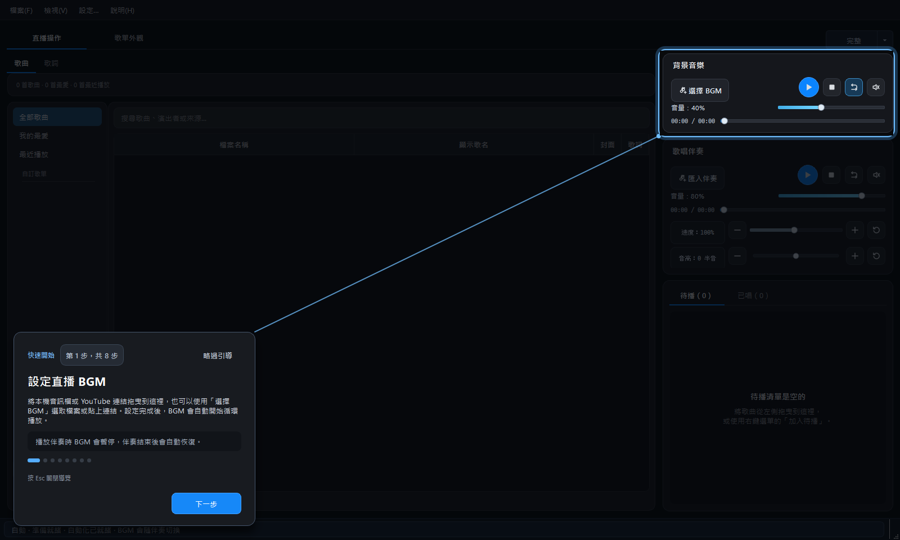
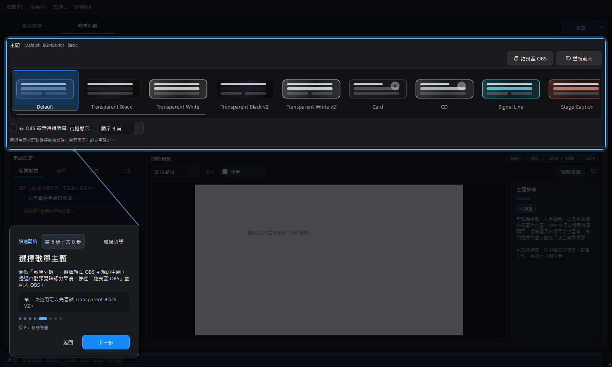

# 安裝、啟動與建立專案

## 解壓縮與啟動

1. 將下載的 ZIP 完整解壓縮到一般資料夾。
2. 在解壓縮後最外層的資料夾中，找到下圖圖示的 `Singing Stream Savior.exe`。
3. 雙擊它即可啟動歌回救星。

<div class="launch-target">
  
  <div>
    <strong>Singing Stream Savior.exe</strong>
    <span>平常只需要開啟這個程式</span>
  </div>
</div>

```text
Singing Stream Savior 2.0.3.1/
└─ Singing Stream Savior.exe        ← 平常開啟這個
```

> 不要直接在 ZIP 壓縮檔預覽視窗中執行程式，也不需要進入其他資料夾尋找主程式。請先完整解壓縮，再開啟最外層這一個 `Singing Stream Savior.exe`。

## 建立新專案

1. 開啟「檔案」選單。
2. 選擇「新增專案」。
3. 將歌曲加入歌曲庫或目前專案。
4. 使用「儲存」或「另存新檔」，建立 `.bgmsproj` 檔案。

專案會保存歌曲、顯示歌名、待播順序、歌詞關聯、主題及相關顯示設定。已唱清單屬於當次直播，不會寫入一般專案存檔；若程式異常中斷，復原快照會保留直播進度，重新啟動時可選擇復原。

## 開啟既有專案

可使用「檔案 > 開啟專案」，或從最近使用的專案清單開啟。若清單中的專案檔已被移動或刪除，程式會自動移除該筆失效紀錄。若上次執行意外中止，程式可能提示是否復原自動儲存內容。

## 跟著初次使用導覽完成設定

2.0.2.0 起，第一次進入操作畫面時會自動開啟「初次使用導覽」。導覽會切換到對應頁面並框出目前要認識的位置；它只負責說明，不會替你修改專案或播放歌曲。

<div class="figure-grid">
  <figure class="manual-figure">
    <a href="assets/images/first-use-tour-bgm.png">
      
    </a>
    <figcaption>第一步會高亮 BGM 播放器，說明拖放、選擇檔案與自動切換機制。點擊圖片可放大查看。</figcaption>
  </figure>
  <figure class="manual-figure">
    <a href="assets/images/first-use-tour-theme.png">
      
    </a>
    <figcaption>第五步會自動切換到「歌單外觀」，讓主題、預覽與「拖曳至 OBS」的位置更容易理解。</figcaption>
  </figure>
</div>

導覽依序介紹以下八個步驟：

1. **設定直播 BGM**：把本機音訊檔或 YouTube 連結拖到整個 BGM 區域，也可以按「選擇 BGM」選擇檔案或貼上連結。設定後會自動循環播放；開始播放伴奏時會暫停，伴奏結束後再恢復。
2. **將伴奏加入歌曲列表**：把本機檔案或 YouTube 連結拖到伴奏播放器或歌曲列表，也可以按「匯入伴奏」選擇檔案或貼上連結。
3. **編輯「顯示歌名」**：這個欄位是歌曲播放時，OBS 歌單畫面會自動顯示的名稱；原始檔名與 YouTube 來源不會被改動。
4. **把歌曲加入待播**：從歌曲列表將歌曲拖入待播區，或使用右鍵選單加入。支援待播顯示的主題便能讓觀眾看到接下來要唱的歌曲。
5. **選擇歌單主題並加入 OBS**：切換到「歌單外觀」，透過自動預覽確認主題效果。可以按住「拖曳至 OBS」拖進 OBS；若直播中無法拖入，也可單擊按鈕複製瀏覽器來源路徑，在 OBS 新增瀏覽器來源後貼到網址欄，尺寸設為 1920 × 1080。第一次可先嘗試 Transparent Black V2。
6. **回到直播操作並開始演唱**：從歌曲列表或待播清單雙擊歌曲即可播放伴奏；BGM 切換、畫面上的歌名與歌單狀態都會自動處理。
7. **選擇同步歌詞**：播放時若自動找到歌詞，會開啟「管理歌詞」。優先選擇時間相近、歌手資訊相符的結果；找不到時，可在搜尋文字中補上歌手名稱再搜尋。
8. **把同步歌詞顯示到 OBS**：切換到「歌詞」分頁，也可在這裡手動開啟「管理歌詞」。接著把「拖曳至 OBS」拖進 OBS；也可單擊複製路徑並貼到新建瀏覽器來源的網址欄。歌詞會跟隨伴奏時間顯示。

如果已經跳過或關閉導覽，之後仍可從軟體上方的「說明(H) > 初次使用導覽」重新開啟。導覽期間使用滑鼠按「下一步」或「返回」切換步驟，按 `Esc` 可關閉。

> 第一次使用不必先調整介面語言、專案／媒體資料夾位置、封面或 OBS WebSocket。先完成 BGM、伴奏、歌單主題及一次測試播放，就已經能開始使用；歌詞功能可依直播需要接著設定。

## 認識完整模式

完整模式是預設的準備工作區，會依目前分頁顯示完整設定：

- 左側：歌曲資料、歌詞或畫面設定。
- 中央：歌曲表格、歌詞預覽或歌單主題預覽。
- 右側：背景音樂、歌唱伴奏、待播與已唱清單。
- 右上角：完整、精簡與迷你模式切換。

<figure class="manual-figure">
  <a href="assets/images/lyrics-reading-preview.png">
    
  </a>
  <figcaption>完整模式的歌詞分頁：中央即時預覽與 OBS 輸出相同，右側播放控制與待播清單仍可同時操作。</figcaption>
</figure>

準備直播時建議先使用完整模式；完成歌曲、主題與歌詞設定後，再視需要切換成精簡或迷你模式。

## 儲存與關閉

視窗標題出現 `*` 代表專案有尚未儲存的變更。切換模式、播放音訊或打開獨立歌詞視窗不會清除目前專案狀態。

[上一頁：說明書首頁](README.md) · [下一頁：歌曲庫、歌單與播放器](library-and-playback.md)
