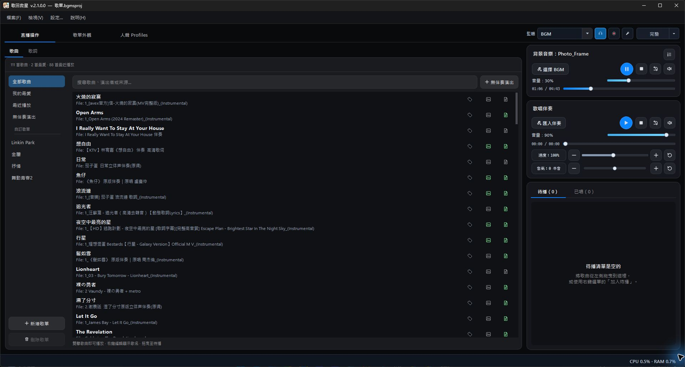
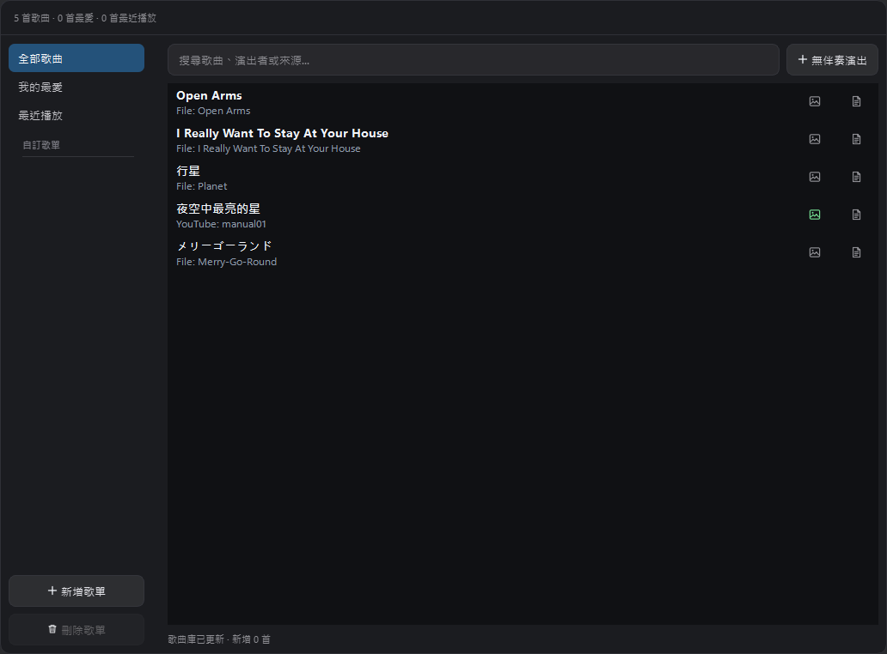
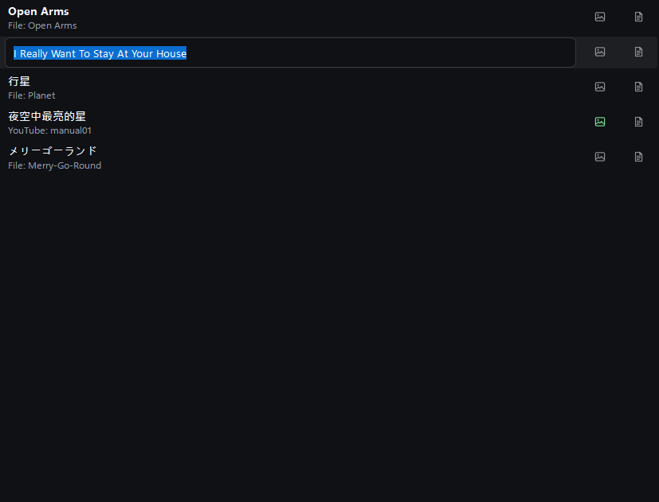
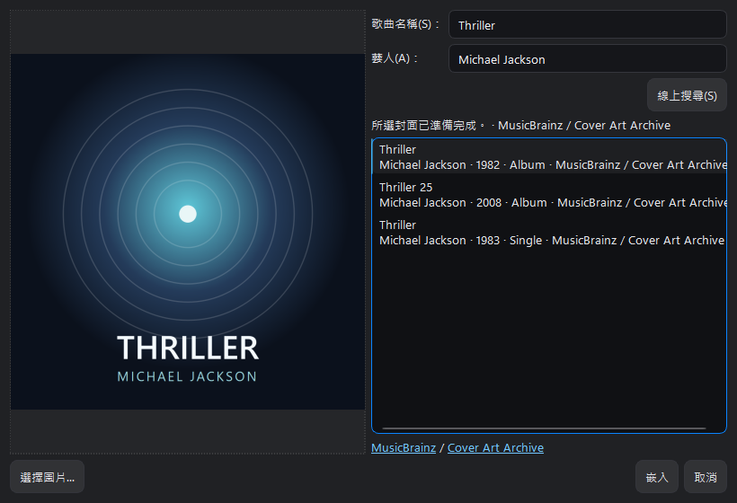

# 歌曲庫、歌單與播放器

<figure class="manual-figure">
  
  <figcaption>完整模式會同時顯示歌曲庫分類、歌曲資料、兩個播放器，以及待播／已唱清單。</figcaption>
</figure>

## 歌曲庫分類

左側歌曲庫包含：

- **全部歌曲**：所有已加入的歌曲。
- **我的最愛**：標記為最愛的歌曲。
- **最近播放**：最近播放過的歌曲。
- **自訂歌單**：自行建立的歌曲分類；同一首歌也可以加入多個歌單。

固定分類無法刪除；自訂歌單可依直播主題或歌回企劃分組。

<figure class="manual-figure">
  
  <figcaption>左側切換歌曲來源，右側會顯示該分類中的歌曲；搜尋欄只篩選目前選取的分類。</figcaption>
</figure>

### 將歌曲加入我的最愛或自訂歌單

1. 在歌曲表格選取一首或多首歌曲。
2. 按滑鼠右鍵，展開「加入歌單」。
3. 選擇「我的最愛」或其中一個自訂歌單。

這項操作只會建立分類關係，不會複製音訊，也不會把歌曲從「全部歌曲」移除。同一首歌可以同時存在於我的最愛及多個自訂歌單。

<figure class="manual-figure manual-figure--medium">
  
  <figcaption>右鍵選單可直接加入待播或加入歌單；圖中示範加入「我的最愛」。</figcaption>
</figure>

## 加入歌曲

除了按下匯入按鈕選擇檔案，歌曲也可以直接拖進軟體：

- 從檔案選擇視窗匯入一首或多首本機音訊。
- 將本機音訊檔案直接拖曳到軟體。
- 貼上或拖曳單一 YouTube 影片連結，加入為一首歌曲。
- 貼上或拖曳 YouTube 播放清單連結，辨識後匯入為一個自訂歌單。
- 按搜尋列右側的「＋ 無伴奏演出」，建立不需要媒體檔的清唱或自彈自唱項目。

本機歌曲／歌唱伴奏支援以下格式：

`MP3`、`WAV`、`FLAC`、`M4A`、`MP4`、`AAC`、`OGG`、`OPUS`、`WMA`

拖入 YouTube 播放清單時，軟體會將其中的歌曲加入歌曲庫，並整理到對應的新歌單，不必逐首貼上連結。YouTube 內容需要網路與隨程式提供的 `yt-dlp` 輔助程式；首次解析或歌曲較多時可能需要稍候。

## 顯示歌名與來源

「顯示歌名」是直播畫面、待播與已唱清單優先使用的名稱。若未填寫，程式會以檔名或 YouTube 標題作為備援，不會顯示空白歌曲。

完整模式可查看來源或檔名；精簡模式會隱藏較佔寬度的來源欄位。

雙擊歌曲列會直接載入並播放歌曲，不會進入文字編輯。要修改名稱，請對歌曲按右鍵，選擇選單第一項「編輯顯示歌名」。輸入完成後按 `Enter` 套用，按 `Esc` 則取消這次編輯。這只會修改直播及清單使用的名稱，不會重新命名原始音訊檔案。

歌曲右鍵選單依序提供：

1. **編輯顯示歌名**：修改直播、待播、已唱與 OBS 使用的名稱。
2. **加入待播**：把歌曲排入稍後要唱的清單。
3. **加入歌單**：加入「我的最愛」或任一自訂歌單。
4. **刪除／從目前歌單移除**：依目前所在分類移除關聯，或從歌曲庫刪除歌曲。

<figure class="manual-figure manual-figure--medium">
  
  <figcaption>從右鍵選單第一項開啟編輯後，編輯框只出現在「顯示歌名」欄；左側檔案名稱維持不變。</figcaption>
</figure>

<section class="manual-feature-update" aria-labelledby="library-bgm-205-title">
  <header class="manual-feature-update__header">
    
2.0.5.0

    <h2 id="library-bgm-205-title">更直覺的歌曲列表與 BGM 播放清單</h2>
    
歌曲庫現在可以在熟悉的傳統列表與卡片列表之間切換；背景音樂也能預先整理成清單，依直播主題快速切換。

  </header>

  

    <h3>歌曲列表顯示</h3>
    
<strong>傳統列表仍是預設值</strong>；想更快辨認歌曲時，可在「設定 → 一般 → 歌曲列表顯示」改用卡片列表。卡片會突出顯示觀眾看到的歌名，同時保留來源、封面與歌詞狀態。雙擊卡片會播放歌曲，鉛筆圖示則用來編輯顯示歌名。

  

  

    <h3>BGM 播放清單</h3>
    
展開「背景音樂」的清單按鈕後，可保存多首本機音檔或 YouTube 音源，替每首 BGM 加上備註，並直接拖曳調整順序。正在播放的項目會清楚高亮；加入 YouTube 播放清單時，也能選擇只加入目前影片，或一次匯入全部項目。

    <ul>
      <li><strong>單曲循環（預設）</strong>：持續播放目前選擇的 BGM。</li>
      <li><strong>全部循環</strong>：依清單順序播放，最後一首結束後回到第一首。</li>
      <li><strong>全部隨機循環</strong>：每次從清單隨機選擇下一首 BGM。</li>
    </ul>
  

  
</section>

## 無伴奏演出

若要清唱、自彈自唱，或進行其他不使用伴奏媒體的演出，可按歌曲列表搜尋列
右側的「＋ 無伴奏演出」。輸入觀眾會看到的顯示歌名，再選擇結束方式：

- **手動結束**：不設定時間，演出會持續到按下停止／完成。
- **設定預計時間**：時間到後自動完成，也能提早手動停止；加減按鈕每次調整
  10 秒，時間欄位也支援滑鼠滾輪。

無伴奏演出不會建立假的靜音音檔。開始後會像一般伴奏一樣暫停 BGM，並更新
Now Singing、待播與已唱；結束後再恢復原本的 BGM。建立的項目會出現在歌曲
列表與「無伴奏演出」智慧分類，也能加入其他自訂歌單並隨專案保存。

## 封面

封面是選用資料，不影響歌曲播放、待播排序或一般歌單顯示。若準備使用 Card 或 CD 主題，設定封面可以得到歌曲專屬的視覺效果。

本機音訊可透過歌曲右鍵選單開啟「嵌入封面」：

1. 輸入歌名與歌手後線上搜尋，或選擇本機圖片。
2. 選取搜尋結果。
3. 等待左側封面預覽載入完成。
4. 按「嵌入」寫入音訊標籤。

<figure class="manual-figure manual-figure--medium">
  
  <figcaption>選取右側搜尋結果並等待左側預覽載入完成後，「嵌入」按鈕就會啟用。</figcaption>
</figure>

YouTube 歌曲預設使用影片縮圖，也可設定自訂封面或恢復預設縮圖。

Card 與 CD 的實際呈現請參考[歌單外觀章節](obs-and-themes.md#card-與-cd封面效果)。

## 背景音樂播放器

BGM 播放器有獨立的播放、暫停、停止、循環、靜音、音量與進度控制。開始播放歌唱伴奏時，程式可協調 BGM 狀態，避免兩條音軌同時干擾演唱。

2.1 的 BGM 與歌唱伴奏音量改用較符合人耳感知的響度曲線，本機音檔與 YouTube 來源共用同一套滑桿數值到輸出增益的映射。更新會保留原本的滑桿數值，但因映射曲線改變，同一數值的聽感可能與舊版不同；請在第一次正式直播前重新確認伴奏與人聲平衡。這是音量控制曲線，不是自動響度標準化。

## 歌唱伴奏播放器

歌唱伴奏提供：

- 播放、暫停、停止與重新開始。
- 獨立音量、靜音及進度。
- 速度調整與重設。
- 音高半音調整與重設。
- 「歌詞視窗」按鈕。

### 為每首歌保存適合自己的速度與 Key

速度與 Key 是演唱時很實用的調整。速度可以用來放慢較難掌握的歌曲、配合練習進度，或微調成直播當天較舒服的節奏；「音高」則以半音為單位升降 Key，音域太高時可以降 Key，太低時也能升 Key，不必另外製作不同調性的伴奏檔。

軟體會為每首歌曲分別記住調整過的速度與音高。切換到其他歌曲再回來時，會恢復這首歌適合的設定，不必在每次演唱前重新調整；需要回到原始狀態時，也可以分別重設為 `100%` 速度與 `0` 半音。

這些設定只影響歌唱伴奏的播放，不會改寫或降低原始音訊檔案的品質。

## 待播與已唱

待播清單是選用的直播管理功能，不是開始播放的必要步驟。直接在歌曲表格中雙擊歌曲，就能立即載入並播放。

若有觀眾點歌、臨時加歌，或已經預定接下來要唱的曲目，可將歌曲拖曳或使用右鍵選單加入「待播」。待播歌曲可以重新排序；播放完成後會進入「已唱」。

「已唱」是當次直播的暫存進度，正常關閉軟體後不會留到下一場直播。若直播中程式異常中斷，軟體會以復原快照保存待播與已唱進度，重新啟動時可選擇恢復。

使用待播時，建議：

1. 確認顯示歌名。
2. 視需要檢查歌詞與封面狀態。
3. 拖曳調整演唱順序。

支援待播顯示的主題會將第一首待播歌曲顯示在 **Next On**，或把數首待播歌曲顯示在 **Reserve**。是否顯示及顯示數量可在「歌單外觀」設定；不建立待播清單不會影響直接播放歌曲。

[上一頁：安裝、啟動與建立專案](getting-started.md) · [下一頁：歌詞、同步歌詞與日文讀音](lyrics.md)
