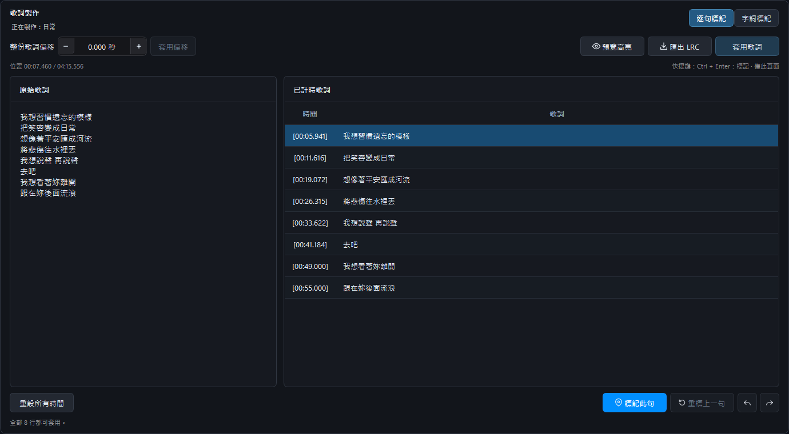
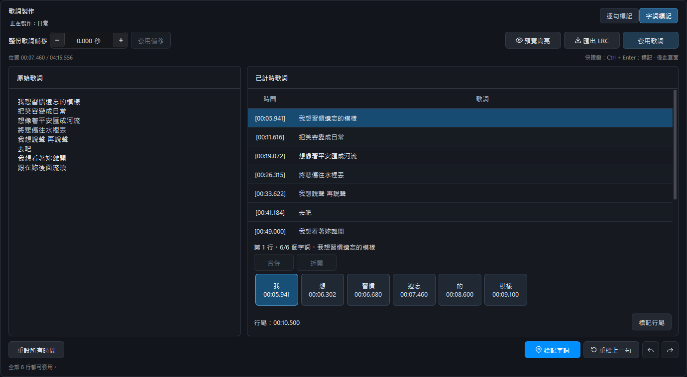

# 歌詞編輯器

搜尋不到理想的歌詞檔時，可以用歌詞編輯器，替準備好的歌詞加上時間標記。

<section class="chapter-quick-start chapter-quick-start--single lyrics-editor-quick-start">
  <ol class="chapter-quick-start__steps">
      <li>
在歌曲列表點選要製作歌詞的歌曲。
</li>
      <li>
開啟「直播操作 → 歌詞製作」，將歌詞貼到左側，每句一行。若歌曲已連結歌詞，會自動載入供編輯。
</li>
      <li>
選擇「逐句標記」，用右側播放器播放伴奏，每句開始時按 <strong>Ctrl + Enter</strong> 或標記按鈕。推薦使用快捷鍵；也可以調慢伴奏，方便對準時間。
</li>
      <li>
開啟「預覽高亮」試播檢查。需要更精細的效果時，再切換「字詞標記」，一邊聽、一邊標記各個字詞。
</li>
      <li>
完成後按「套用歌詞」，即可自動儲存並連結歌曲，再儲存專案。
</li>
  </ol>
</section>

<figure class="manual-figure"><figcaption>逐句標記：左側貼上原始歌詞，右側記錄時間。</figcaption></figure>

## 字詞的選取、合併與拆開

英文預設以完整詞彙分成按鈕，韓文依空格分詞；中文與日文可逐字標記，再合併為自己想要的詞。每次標記會移到下一個字詞，完成一句後接續下一句。

- **Ctrl + 點擊**：加入或取消個別選取。
- **Shift + 點擊**：先點第一個字詞，再按住 Shift 點最後一個，選取中間整段。
- **合併**：選取相鄰字詞，例如「習」「慣」，再按「合併」成為「習慣」。原有的個別時間仍會保留。
- **拆開**：選取一個詞並按「拆開」。若原本已有個別字的時間，會恢復；沒有時間的字維持未標記，可再補標。

標錯時可使用復原、重做或重標上一句。不必全部標完才能預覽；點擊右側表格已記錄的時間，也能跳回該處重聽。空白行可以標記為間奏，**Ctrl + Enter** 只在本頁作用。

「整份歌詞偏移」可讓所有標記一起提前或延後，最多 ±20 秒。「套用歌詞」會存到統一的歌詞資料夾，預設位置可在「設定 → 檔案與專案」修改；「匯出 LRC」則可選擇其他位置。若標記時修改了伴奏速度，離開頁面會詢問是否恢復進入編輯器時的速度。

<figure class="manual-figure"><figcaption>字詞標記：可選取、合併、拆開字詞，並用預覽高亮檢查時間。</figcaption></figure>

[上一頁：歌詞功能](lyrics.md) · [下一頁：歌單外觀、歌詞畫面與 OBS](obs-and-themes.md)
