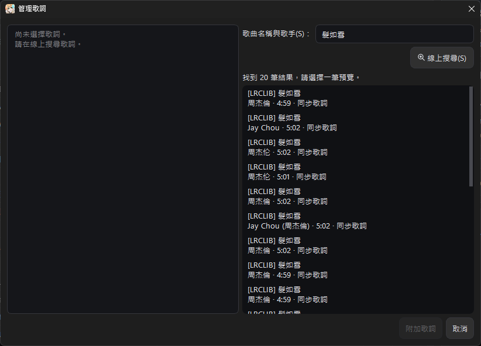
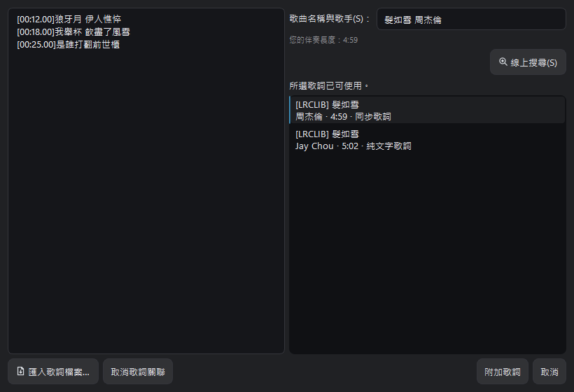
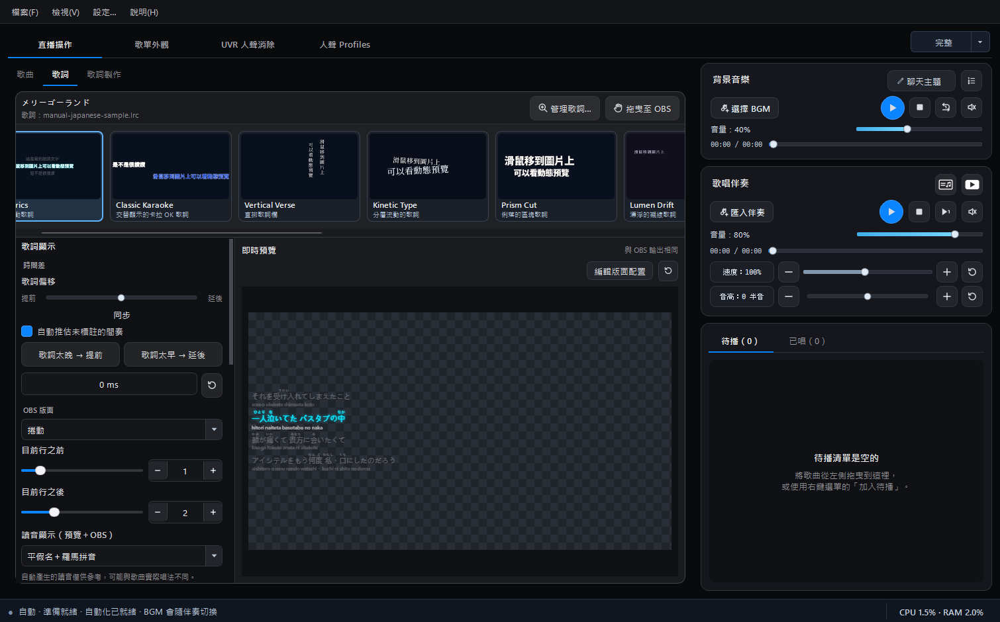
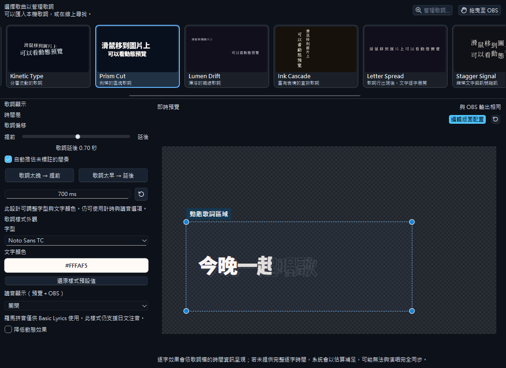
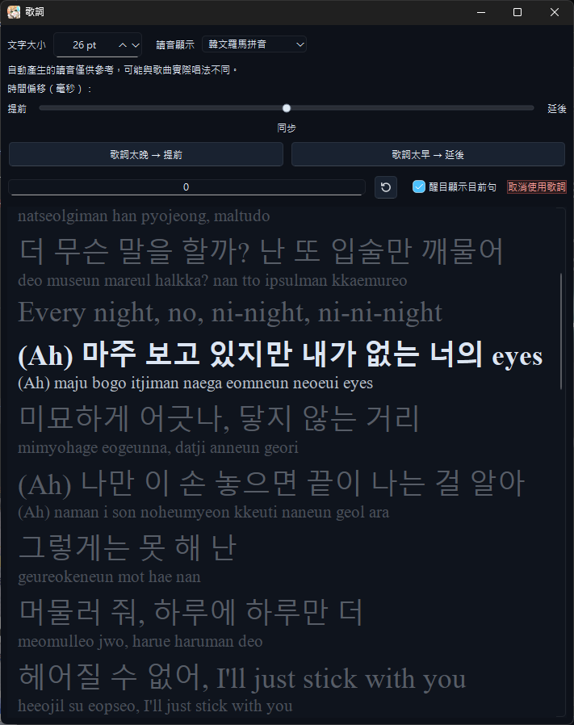

# 歌詞、同步歌詞與日韓讀音

<section class="chapter-quick-start" aria-labelledby="lyrics-quick-start">
  

    
先完成一份歌詞

    <h2 id="lyrics-quick-start">替目前歌曲加入同步歌詞</h2>
    
可以搜尋線上歌詞，也可以直接匯入已準備好的 LRC。

    <ol class="chapter-quick-start__steps">
      <li>
<strong>選擇歌曲</strong>在歌曲列表點該歌曲的「歌詞」圖示，或到「歌詞」頁按「管理歌詞…」。
</li>
      <li>
<strong>取得歌詞</strong>從右側搜尋 LRCLIB／YouTube 字幕，或按「選擇 LRC 檔案」匯入本機歌詞。
</li>
      <li>
<strong>預覽並附加</strong>確認文字與歌曲長度後，按「附加歌詞」。
</li>
      <li>
<strong>播放確認</strong>播放伴奏，確認目前句會跟著進度醒目顯示；需要時再調整提前或延後。
</li>
    </ol>
    
<strong>完成時：</strong>主畫面預覽、獨立歌詞視窗與 OBS 歌詞畫面都能使用這份歌詞。

  

  <figure class="manual-figure">
    
    <figcaption>右側選擇候選歌詞，左側先確認內容，再按「附加歌詞」。</figcaption>
  </figure>
</section>

歌詞是選用功能，不設定歌詞也能正常播放伴奏。設定歌詞後有兩種主要用途：

1. 主播可開啟獨立的「歌詞視窗」，移到最容易閱讀的位置。
2. 可將歌詞 Overlay 拖曳到 OBS，讓觀眾看到同步歌詞。

## 支援的歌詞

程式支援同步與非同步歌詞，包括：

- LRC
- SRT
- VTT
- 純文字歌詞
- YouTube CC 或自動產生字幕
- LRCLIB 線上歌詞

有時間標記的歌詞可跟隨伴奏進度，自動捲動並醒目顯示目前句。

「歌詞視窗」與「YouTube 影片」按鈕固定在**伴奏播放器標題列的右上角**，不是歌詞頁面的按鈕。請參考下方的[按鈕位置放大圖與開啟方式](#player-window-buttons)。

## 使用「管理歌詞」

在歌曲的「歌詞」頁按「管理歌詞…」，或直接點選歌曲列表中該歌曲「歌詞」欄的圖示，都可以開啟管理歌詞視窗。你可以在這裡：

- 搜尋 YouTube 字幕與 LRCLIB。
- 匯入本機 LRC 或其他支援格式。
- 取消目前歌曲的歌詞關聯。

線上搜尋最多顯示 50 筆結果，並優先排列同步歌詞；若伴奏長度已知，與伴奏長度較接近的結果會排在前面。

選取搜尋結果後，待預覽載入完成即可直接按「附加歌詞」，不需要先按另一個採用按鈕。

### 匯入 LRC 與取消歌詞連結

- **選擇 LRC 檔案：** 從電腦匯入自行準備的 LRC、SRT、VTT 或純文字歌詞。
- **取消歌詞連結：** 移除目前歌曲與歌詞檔的關聯，不會刪除原始音訊。
- **附加歌詞：** 選取並預覽線上結果後，將該份歌詞連結到歌曲。

> **歌詞來源與授權：** LRCLIB 與 YouTube 字幕等搜尋來源提供的是歌詞查找，不代表已取得歌詞的使用授權。使用前請確認歌詞來源、相關權利及服務規範。

當歌曲已經附加歌詞時，管理視窗會明確顯示目前狀態，並提供「取消歌詞連結」。因此不需要回到主畫面尋找重複功能。

如果搜尋結果都不適合，請不要勉強附加；改為將準備好的歌詞貼到歌詞編輯器，或匯入 LRC、SRT、VTT／純文字檔，再自行標記時間。

<figure class="manual-figure manual-figure--medium">
  
  <figcaption>已有歌詞時，左下角可重新匯入檔案或取消目前的歌詞連結。</figcaption>
</figure>

## 自動搜尋

若已啟用自動搜尋，播放沒有歌詞的歌曲時，程式會同時整理 LRCLIB 與 YouTube 字幕候選，再依同步狀態、語言、歌曲長度與歌手資訊排序，最後讓使用者確認是否附加，不會在未確認時直接覆蓋既有歌詞。若 YouTube 因短時間請求過多而限制字幕下載，視窗會保留其他可用候選並顯示清楚提示，可稍後再試。



## 歌詞預覽與 OBS

### 歌詞頁預覽與獨立視窗的差別

歌詞頁的即時預覽使用與 OBS 相同的版面、字型、顏色與日韓讀音設定，用來確認 OBS 實際顯示效果；這裡不是開啟獨立歌詞視窗的入口。

如果只需要自己看歌詞，不必把歌詞 Overlay 加入 OBS；如果只想讓觀眾看，也可以維持歌詞視窗關閉。

<figure class="manual-figure">
  
  <figcaption>左側歌詞頁用來調整與預覽 OBS 顯示效果；要開啟自己閱讀的歌詞視窗或 YouTube 畫面，請使用右側伴奏播放器的兩個圖示（見上方放大圖）。</figcaption>
</figure>

### 歌詞使用提醒

Singing Stream Savior 提供歌詞匯入、編輯、同步與顯示工具，不提供第三方歌曲的歌詞使用授權。公開直播、影片或其他用途是否可以顯示歌詞，仍應依作品授權、平台規範及適用法律確認。



### 在預覽中移動與縮放歌詞區塊

從 **2.1.3.2** 起，Basic Lyrics、Classic Karaoke 與 Vertical Verse 都能直接在歌詞頁的預覽中調整位置與大小。

1. 在「直播操作 → 歌詞」選擇歌詞樣式，按預覽右上方的「編輯版面配置」。
2. 拖曳歌詞區塊的外框內部來移動位置；拖曳角落的縮放控制點，等比例放大或縮小。調整的是歌詞區塊，畫布維持 `1920 × 1080`、`16:9`。
3. 已加入 OBS 的同一份歌詞來源會在拖曳過程中即時更新，不必等滑鼠放開，也不用重新拖入 OBS。

拖近水平或垂直中線時會提供對齊輔助。完成後再按一次「編輯版面配置」即可退出；切換到其他頁面也會退出編輯，保留調好的位置。旁邊的重設圖示可恢復版面配置；請儲存專案以保留調整。

透明方格代表透明區域，不會輸出到 OBS。此處調整的是 OBS 歌詞版面，不是獨立「歌詞視窗」的位置。

<figure class="manual-figure">
  
  <figcaption>Classic Karaoke 的虛線框包住歌詞區塊；可在固定 16:9 畫布內移動及等比例縮放，並即時同步 OBS。</figcaption>
</figure>

## 日文讀音

讀音選項包括：

- **關閉**：只顯示原始歌詞。
- **平假名注音**：以較小的平假名標示漢字讀音。
- **羅馬拼音**：在原始歌詞下方顯示分詞後的羅馬拼音。
- **平假名＋羅馬拼音**：同時保留平假名注音與原文下方的羅馬拼音。

「即時預覽 + OBS」共用一組設定；「歌詞視窗」使用另一組設定。

程式會先判斷歌詞是否適合日文讀音處理，避免對一般中文或英文歌詞產生不必要的羅馬拼音。讀音由內建的離線日文分析與斷詞引擎產生，不需要將歌詞上傳到網路。

## 韓文羅馬拼音

韓文歌詞可選擇顯示羅馬拼音。程式會依韓文詞組保留可閱讀的空格，不會把整句
拼成一串；主畫面、歌詞視窗與 OBS 使用相同的背景讀音服務，讓載入結果保持
一致。和日文讀音一樣，這是離線自動產生的演唱參考，特殊人名、外來語與歌曲
中的實際唱法仍可能不同。

> **讀音僅供參考：** 自動讀音依離線字典與斷詞結果產生。人名、特殊讀法、歌詞省略、外來語及歌手刻意改變的唱法，可能與原曲不同。

<figure class="manual-figure">
  
  <figcaption>韓文羅馬拼音會顯示在原句下方並保留詞間空格；主畫面即時預覽、歌詞視窗與 OBS 都可使用。</figcaption>
</figure>

## 時間校正

若歌詞與伴奏不同步，不需要先換算正負號，直接依看到的問題選擇：

- **歌詞太晚 → 提前**：目前句已經唱到，歌詞卻還沒出現時使用。
- **歌詞太早 → 延後**：歌詞先出現、實際演唱稍後才到時使用。
- **偏移滑桿**：中央是同步；往左拖代表提前，往右拖代表延後。
- **重設圖示**：回到 `0 ms`。

建議從副歌或節奏清楚的段落測試，再逐步微調。

調整偏移後，歌詞頁預覽、獨立歌詞視窗與 OBS 歌詞資料會立即使用新數值；即使伴奏目前暫停，也不必關閉歌詞視窗再重新開啟。

「目前行之前」與「目前行之後」可分別用滑桿或數值欄位設定顯示句數。若歌曲已接近開頭或結尾，實際可顯示的歌詞會少於設定值，這是因為已經沒有更多前句或後句。

歌詞視窗的實際畫面與開啟方式，請參考上方的[歌詞視窗](#lyrics-window)小節。

## 將歌詞加入 OBS

> **公開顯示歌詞前：** 搜尋結果與匯入功能不等於歌詞授權。請確認您可以在直播或影片中公開使用該份歌詞；伴奏的使用許可，也不應直接推定包含歌詞文字的公開顯示。

1. 到歌曲的「歌詞」頁。
2. 確認 OBS 版面、字型、大小、顏色與讀音。
3. 選擇其中一種方式：按住「拖曳至 OBS」拖入 OBS；或單擊按鈕複製瀏覽器來源路徑。
4. 若使用複製路徑，請在 OBS 新增瀏覽器來源，將路徑貼到網址欄，並把尺寸設為 1920 × 1080；不必勾選「本機檔案」。

[上一頁：歌曲庫、歌單與播放器](library-and-playback.md) · [下一頁：歌詞編輯器](lyrics-editor.md)
