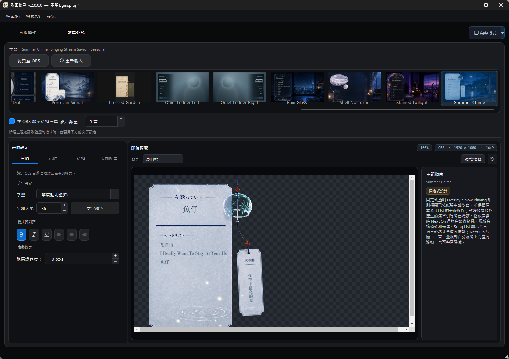
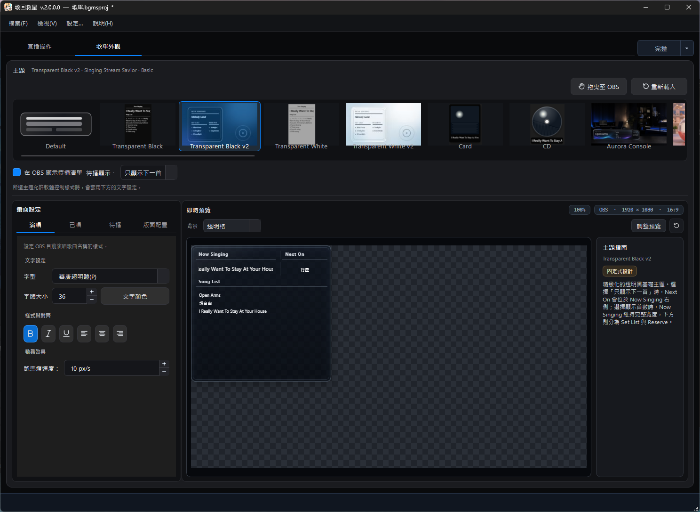
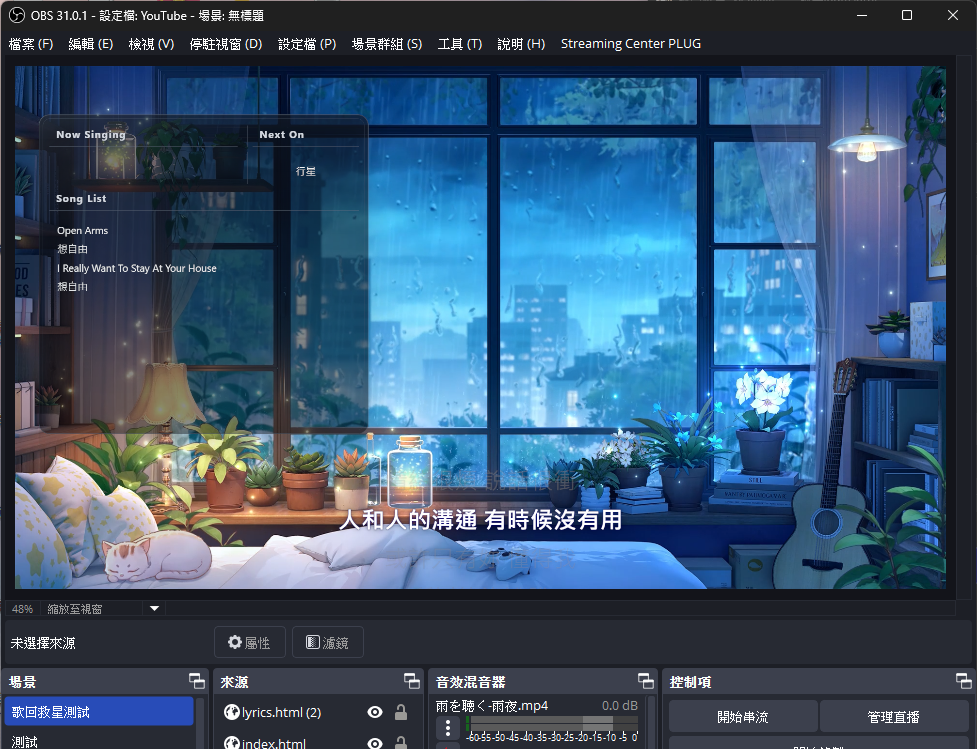
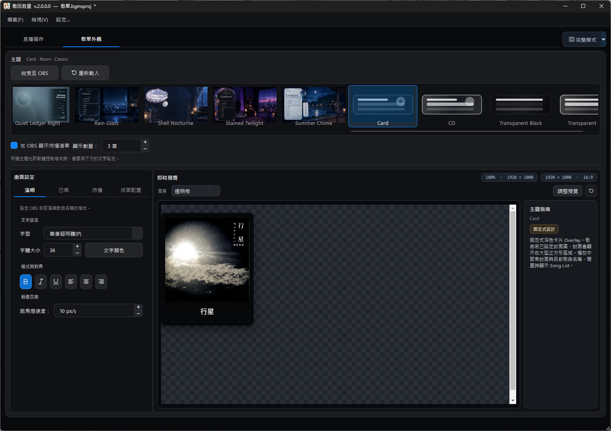
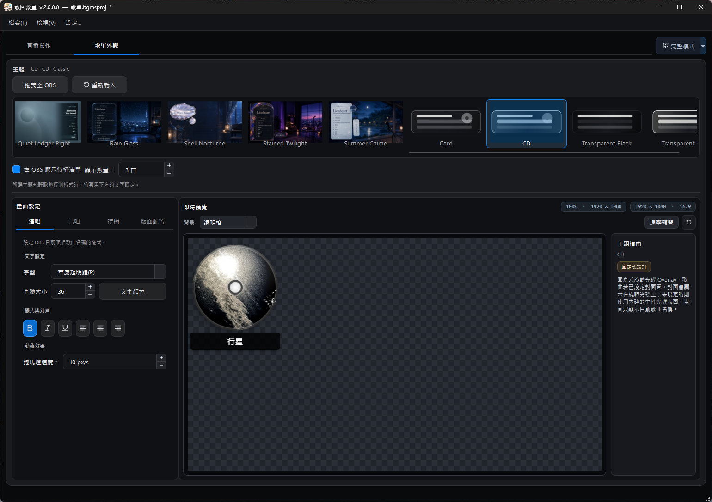

# 歌單外觀、歌詞畫面與 OBS

<figure class="manual-figure">
  
  <figcaption>歌單外觀頁會同時顯示主題卡片、畫面設定、全自動展示與主題指南。</figcaption>
</figure>

## 歌單外觀頁

「歌單外觀」用來選擇 OBS 歌單主題及檢查即時預覽。主題順序會先顯示基本主題，再顯示具完整美術設計的精緻主題。

基本主題包括：

1. Default
2. Transparent Black
3. Transparent White
4. Transparent Black v2
5. Transparent White v2
6. Card
7. CD
8. Signal Line
9. Stage Caption

其他主題可能支援封面、Reserve、Next On、固定版面、動畫或直向設計。右側「主題指南」會說明目前主題的特性及可調整項目。

### 切換與預覽主題

1. 在上方主題列點選主題卡片。
2. 開啟「自動展示」，查看中央預覽依序模擬 Now Singing、長 Set List、時間戳與 Next On／Reserve。
3. 先查看最左側的「版面配置」，再依主題指南調整該主題實際支援的顏色、透明度、字型或版面位置。
4. 讓展示循環跑過不同狀態，確認清單移動、Card／CD 封面與待播區塊；不支援的內容不會被硬塞進主題。
5. 確認後再將「拖曳至 OBS」拖入 OBS。

切換主題只會改變顯示方式，不會修改歌曲、待播順序或已唱紀錄。完整模式最適合比較主題，因為主題列、設定、預覽及指南可以同時顯示。

自動展示使用內建假資料，會自行循環，不需要實際播放伴奏或逐一按按鈕。它也不會把展示歌曲寫入目前專案、已唱紀錄、待播清單或 OBS；關閉展示後會立即回到真實狀態。

### 從即時預覽到 OBS 實際畫面

程式內的即時預覽用來確認主題結構與內容；加入 OBS 後，透明主題會直接疊在直播背景上。歌單與歌詞是兩個獨立來源，因此可以分別安排大小及位置。

  <figure class="manual-figure">
    
    <figcaption>軟體內：自動展示會以長歌單與時間戳，呈現 Now Singing、Set List 與 Next On 的實際配置。</figcaption>
  </figure>
  <figure class="manual-figure">
    
    <figcaption>OBS 中：歌單與歌詞可各自縮放、裁切和移動，搭配自己的直播背景。</figcaption>
  </figure>

## 可以設定的項目

左側「畫面設定」會把「版面配置」放在最左邊，之後才是演唱、已唱與待播。設定會儲存在目前專案中；程式會依主題宣告的能力，只顯示真正可用的分頁與控制項。

| 分頁 | 影響的 OBS 區域 | 可以調整 |
| --- | --- | --- |
| **版面配置** | 主題整體外觀或各文字區域 | 依主題支援項目顯示主題顏色、背景透明度或自訂區塊位置；「恢復主題預設值／版面」可回到原始設計 |
| **演唱** | Now Singing／目前歌曲 | 字型、字體大小、文字顏色、粗體、斜體、底線、靠左／置中／靠右，以及長歌名的跑馬燈速度 |
| **已唱** | Set List／History | 字型、字體大小、文字顏色、是否顯示編號、粗體、斜體、底線、文字對齊，以及清單捲動速度 |
| **待播** | Reserve／Next On | 可與已唱清單分開設定字型、大小、顏色、編號、粗體、斜體、底線與文字對齊 |

### 主題可能限制部分選項

- 標示為**可調整**的主題只會顯示它宣告支援的控制項。
- 標示為**固定設計**的主題會隱藏不適用的字型、顏色、對齊與版面設定，避免使用者誤以為按鈕故障。
- Default 支援最多文字與區塊設定；舊版 Transparent Black／White 支援演唱與已唱的字型、大小、顏色、樣式及對齊。
- Transparent Black／White v2 支援主題顏色與背景透明度；Signal Line 與 Stage Caption 也支援主題顏色、背景透明度與指定區域的字型選擇。
- 不支援 Reserve 的主題不會顯示待播內容。
- 部分美術主題的 Next On／Reserve 是版面必要元素，待播顯示可能固定開啟。
- 調整前可先查看右側「主題指南」，確認該主題支援哪些功能。

### 待播與時間戳選項

- **在 OBS 顯示待播清單：** 讓支援的主題顯示 Reserve 或 Next On。
- **顯示數量：** 設定 OBS 最多顯示 1–10 首待播歌曲；若主題只提供 Next On，畫面只會顯示下一首。
- **在歌單中顯示時間：** 僅在啟用 OBS WebSocket 後出現。開啟後，支援的 Set List 會在已唱歌曲前顯示直播時間戳；時間不會加在 Reserve 或 Next On 前面。

### 即時預覽工具

- **背景：** 可切換透明格、深色、淺色、自訂顏色或自訂圖片。
- **圖片模式：** 使用自訂圖片時，可選擇符合、填滿或拉伸。
- **調整預覽：** 可拖曳預覽來源及角落控制點，暫時改變程式中的檢查大小與位置。
- **重設：** 將預覽來源恢復到 100% 與預設位置。

預覽背景、圖片及「調整預覽」都只用於程式內檢查，不會改變 OBS 的透明輸出，也不會改寫主題的實際版面。預覽右上角的 `OBS · 1920 × 1080 · 16:9` 表示主題的 OBS 設計畫布；百分比則是目前程式內的預覽縮放。

## Card 與 CD：封面效果

封面不是必填資料。Card 與 CD 是兩個會特別利用歌曲封面的基本主題：

- **Card：** 把封面放入直向卡片，並在卡片下方顯示歌曲名稱。
- **CD：** 將封面裁成唱片視覺，歌曲名稱顯示在下方標籤。

未設定封面時仍可播放歌曲及使用其他主題；只有想使用這兩種歌曲專屬效果時，才需要另外整理封面。

  <figure class="manual-figure">
    
    <figcaption>Card：以歌曲封面製作直向卡片。</figcaption>
  </figure>
  <figure class="manual-figure">
    
    <figcaption>CD：將歌曲封面轉為圓形唱片視覺。</figcaption>
  </figure>

## 預覽背景

Default 主題預設使用白色預覽背景；透明主題與精緻主題可使用透明格，方便判斷半透明與留白效果。

預覽背景只影響程式內檢查，不會輸出到 OBS。

## 將歌單加入 OBS

1. 在「歌單外觀」選擇主題。
2. 確認預覽中的 Now Singing、Set List、Reserve 或 Next On。
3. 選擇其中一種方式：按住右上方的「拖曳至 OBS」並拖入 OBS；或單擊按鈕複製瀏覽器來源路徑。
4. 若使用拖曳，OBS 會直接建立指向本機 Overlay 的 Browser Source。
5. 若使用複製路徑，請在 OBS 新增瀏覽器來源，將路徑貼到網址欄並設定為 1920 × 1080；不必勾選「本機檔案」。

「重新載入」可重新掃描主題並更新預覽。

> 拖曳與複製路徑都不需要啟用 OBS WebSocket。WebSocket 是額外的時間戳與連線狀態功能。若 OBS 在串流中不接受拖入來源，請改用單擊複製路徑的方式。

## 在 OBS 中自由擺放與裁切

主題的設計畫布不會限制 OBS 中的使用方式。加入 Browser Source 後，可以依自己的直播版面自由縮放、裁切及定位，只保留想顯示的區域，再和自製背景、聊天室或其他來源搭配。

- **Default：** 適合當作可自由組合的基礎版面。可以參考預覽中的虛線文字區域，在 OBS 沿虛線裁切 Now Singing、Set List 等需要的區塊，再放到自製背景的合適位置。
- **透明與精緻主題：** 可保留完整構圖，也可以依直播畫面裁切其中一部分；是否保留裝飾、Reserve 或 Next On，由使用者自行決定。
- **尺寸與位置：** 如果比例或位置不理想，直接使用 OBS 的 Transform、縮放與裁切調整即可，不必符合固定的 Browser Source 尺寸。
- **透明背景：** 主題背景透明是正常現象，請在 OBS 中疊到實際直播背景上確認最終效果。

裁切只會改變 OBS 場景中這個來源的顯示範圍，不會修改歌回救星內的主題或歌曲資料。

## Set List 與長歌名

各官方主題會依版面使用跑馬燈、換行、分頁或縮排處理長歌名。切換主題不會修改歌曲資料、已唱紀錄或待播順序。

## Reserve 與 Next On

開啟「在 OBS 顯示待播清單」後，可設定最多顯示幾首歌曲。不同主題的呈現方式不同：

- Reserve：顯示多首待播。
- Next On：只顯示下一首。
- 不支援待播的主題：維持 Now Singing 或 Set List 版面。

待播清單不是播放歌曲的必要條件。它主要用於觀眾點歌或預排接下來要唱的歌曲；若沒有建立待播，仍可在歌曲表格雙擊歌曲直接播放。

## 歌詞畫面

歌詞 Overlay 是選用畫面，與歌單 Overlay 屬於兩個獨立 Browser Source，可分別放置、縮放與顯示。主播也能只使用獨立歌詞視窗而不輸出給觀眾；詳細設定請參考[歌詞章節](lyrics.md)。

[上一頁：歌詞、同步歌詞與日韓讀音](lyrics.md) · [下一頁：OBS WebSocket 與直播時間戳](obs-websocket.md)
