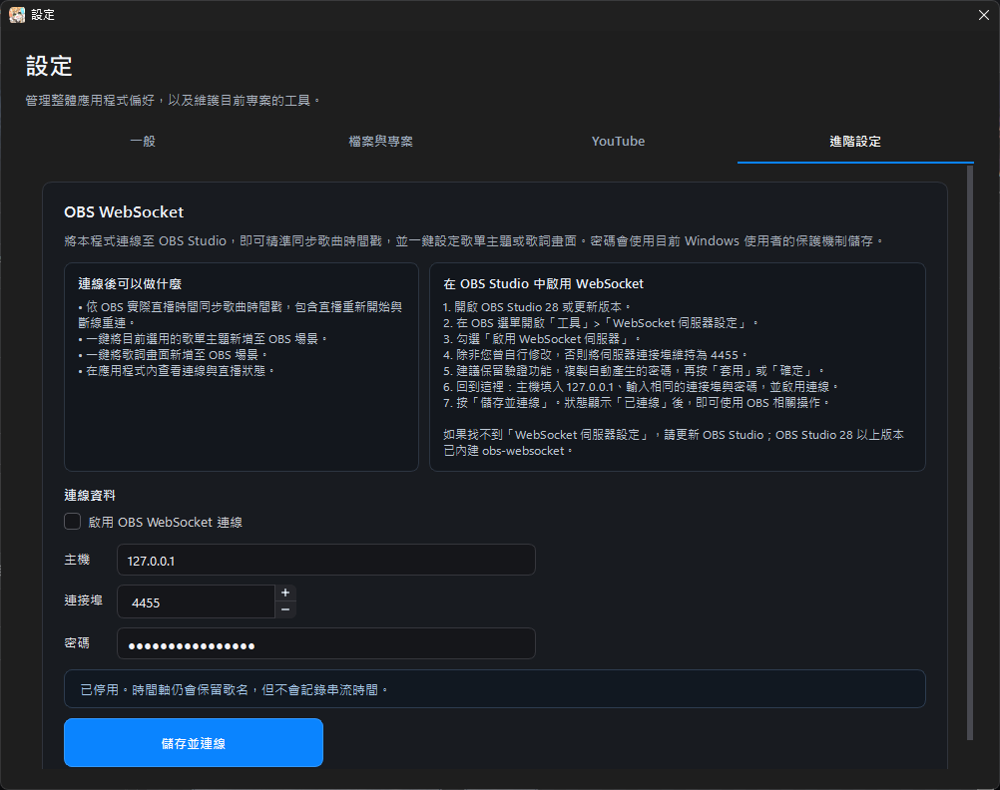

# OBS WebSocket 與直播時間戳

> **選用功能。** OBS WebSocket 主要為直播時間戳設計。一般歌單主題與歌詞 Overlay 不需要啟用這項連線。

OBS WebSocket 預設關閉，可提供以下功能：

- 讀取 OBS 實際直播時間。
- 在伴奏開始時記錄歌曲時間戳。
- 在支援的 Set List 主題顯示歌曲時間戳。
- 處理直播重新開始與短暫斷線重連。
- 在主視窗右下角查看 OBS 連線狀態。

## 在 OBS Studio 啟用 WebSocket

1. 開啟 OBS Studio 28 或更新版本。
2. 開啟「工具 > WebSocket 伺服器設定」。
3. 勾選啟用 WebSocket 伺服器。
4. 連接埠通常維持 `4455`。
5. 建議保留驗證功能，複製 OBS 顯示的密碼。
6. 按「套用」或「確定」。

若找不到 WebSocket 伺服器設定，請更新 OBS Studio。OBS Studio 28 以上版本已內建 obs-websocket。

## 在歌回救星連線

1. 在 2.1.0.0 開啟「設定 > 直播時間戳」。目前公開版則仍是「設定 > 進階設定」。
2. 勾選「啟用 OBS WebSocket 連線」。
3. 主機填入 `127.0.0.1`。
4. 連接埠填入 `4455`，或填入 OBS 中自行設定的連接埠。
5. 輸入和 OBS 相同的密碼。
6. 按「連線」。

只有勾選啟用 WebSocket 後，「連線」按鈕才可使用。取消勾選會立即停用連線及 WebSocket 專用功能。

<figure class="manual-figure">
  
  <figcaption>此圖為目前公開版畫面；2.1.0.0 起分頁名稱改為「直播時間戳」，設定內容與用途不變。</figcaption>
</figure>

## 連線狀態

啟用 WebSocket 後，主視窗右下角會顯示：

- **綠燈／已連線**：可以取得直播時間。
- **黃燈／連線中**：正在連線、驗證或重新連線。
- **紅燈／未連線**：OBS 未開啟、設定不符、密碼錯誤或連線失敗。

若未啟用 WebSocket，主視窗不顯示此狀態。

## 在 Set List 顯示時間

連線功能啟用後，「歌單外觀」會顯示「在歌單中顯示時間」選項。勾選後，支援的主題會在已唱歌曲前加入直播時間戳。

時間戳屬於已唱紀錄，不會顯示在 Reserve 或 Next On。

## 直播時間軸

伴奏開始時會建立一筆紀錄，目標是讓直播結束後更容易整理歌曲時間軸，並讓 Set List 顯示觀眾可辨識的演唱時間。

此功能仍在測試連線穩定性、直播重新開始及短暫斷線等情況。正式直播前請先用測試串流確認；若連線不穩，仍可正常使用播放器、歌單及歌詞，只是無法保證自動時間戳完整。

## 連不上 OBS

依序檢查：

1. OBS 是否已啟動。
2. OBS WebSocket 伺服器是否已啟用。
3. 主機是否為 `127.0.0.1`。
4. 兩邊連接埠是否相同。
5. 密碼是否完整且沒有多餘空格。
6. OBS 是否正在顯示驗證失敗。
7. 關閉後重新勾選，再按一次「連線」。

[上一頁：歌單外觀、歌詞畫面與 OBS](obs-and-themes.md) · [下一頁：完整、精簡與迷你模式](workspace-modes.md)
