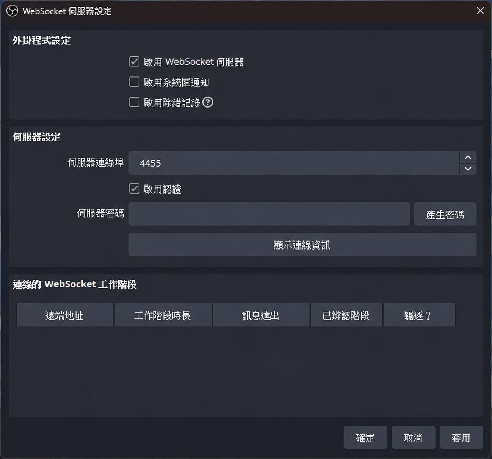
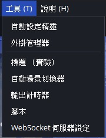
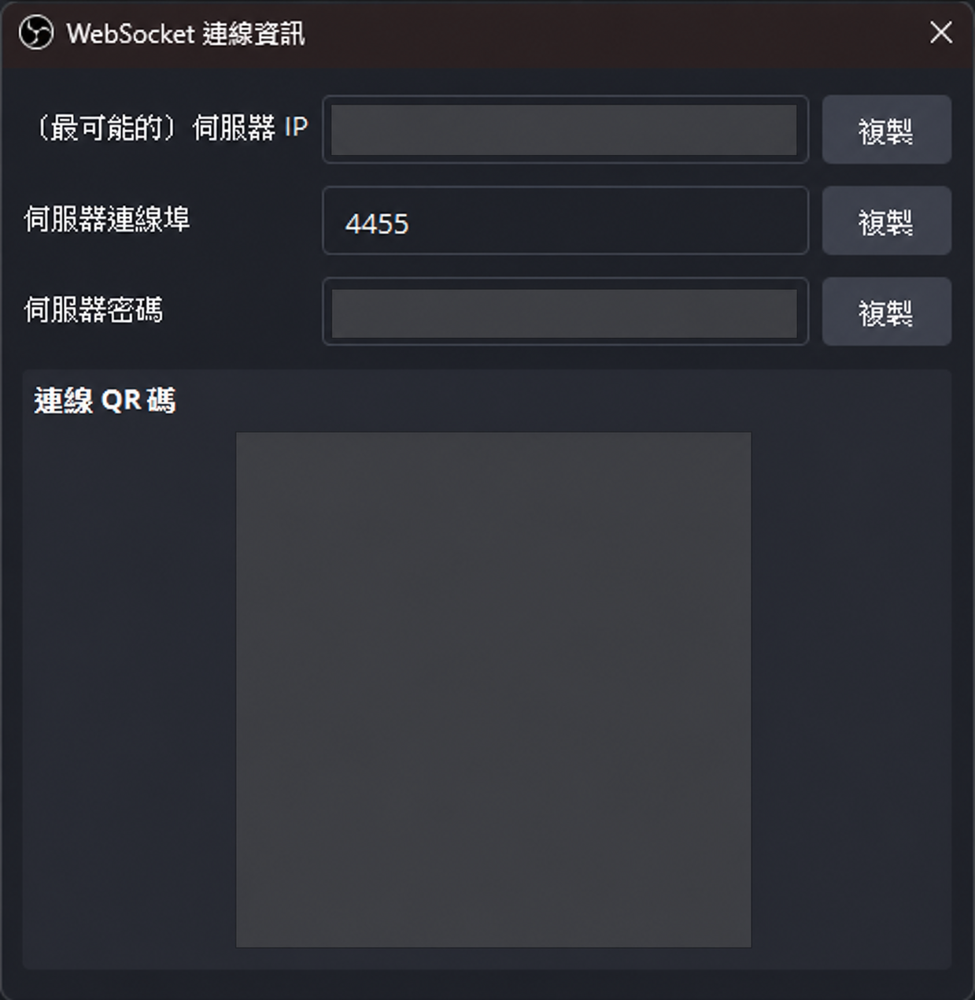

# 直播時間戳擷取

> **選用功能。** 直播時間戳擷取會透過 OBS WebSocket 讀取實際直播時間。一般歌單主題與歌詞 Overlay 不需要啟用這項連線。

<section class="chapter-quick-start" aria-labelledby="timestamp-quick-start">
  

    
OBS 與歌回救星各設定一次

    <h2 id="timestamp-quick-start">讓歌單記錄直播時間戳</h2>
    <ol class="chapter-quick-start__steps">
      <li>
<strong>在 OBS 開啟伺服器設定</strong>選擇「工具 > WebSocket 伺服器設定」，勾選啟用伺服器與驗證，連接埠通常維持 4455。
</li>
      <li>
<strong>取得密碼並儲存</strong>按「顯示連線資訊」複製密碼，關閉資訊視窗後按「確定」。
</li>
      <li>
<strong>在歌回救星連線</strong>開啟「設定 > 直播時間戳」，勾選「啟用 OBS WebSocket 連線」，主機填 127.0.0.1，再輸入相同連接埠與密碼並按「連線」。
</li>
      <li>
<strong>確認連線</strong>主視窗右下角顯示綠燈／已連線後，播放伴奏時就能記錄實際直播時間。
</li>
      <li>
<strong>顯示在歌單（選用）</strong>到「歌單外觀」勾選「在歌單中顯示時間」，支援的 Set List 主題便會顯示歌曲時間戳。
</li>
    </ol>
    
<strong>完成時：</strong>播放伴奏會記錄它在直播中的開始時間；不需要時間戳時可維持關閉。

  

  <figure class="manual-figure">
    
    <figcaption>啟用伺服器與驗證、維持連接埠 4455，再按「顯示連線資訊」。</figcaption>
  </figure>
</section>

## 啟用後能做什麼

OBS WebSocket 預設關閉，可提供以下功能：

- 讀取 OBS 實際直播時間。
- 在伴奏開始時記錄歌曲時間戳。
- 在支援的 Set List 主題顯示歌曲時間戳。
- 處理直播重新開始與短暫斷線重連。
- 在主視窗右下角查看 OBS 連線狀態。

## 在 OBS Studio 啟用 WebSocket

1. 開啟 OBS Studio 28 或更新版本。
2. 開啟「工具 > WebSocket 伺服器設定」。
3. 勾選啟用 WebSocket 伺服器。
4. 連接埠通常維持 `4455`。
5. 建議保留驗證功能；第一次設定時可按「產生密碼」。
6. 按「顯示連線資訊」，確認連接埠並複製伺服器密碼。若歌回救星與 OBS 在同一台電腦，歌回救星的主機仍填 `127.0.0.1`，不必填畫面中的區域網路 IP。
7. 關閉連線資訊視窗後，按「確定」儲存並關閉設定。

<figure class="manual-figure manual-figure--small">
  
  <figcaption>在 OBS Studio 的「工具」選單開啟「WebSocket 伺服器設定」。</figcaption>
</figure>

<figure class="manual-figure manual-figure--medium">
  
  <figcaption>從連線資訊複製密碼；同一台電腦連線時，歌回救星的主機填入 127.0.0.1。</figcaption>
</figure>

若找不到 WebSocket 伺服器設定，請更新 OBS Studio。OBS Studio 28 以上版本已內建 obs-websocket。

## 在歌回救星連線

1. 開啟「設定 > 直播時間戳」。
2. 勾選「啟用 OBS WebSocket 連線」。
3. 主機填入 `127.0.0.1`。
4. 連接埠填入 `4455`，或填入 OBS 中自行設定的連接埠。
5. 輸入和 OBS 相同的密碼。
6. 按「連線」。

只有勾選啟用 WebSocket 後，「連線」按鈕才可使用。取消勾選會立即停用連線及 WebSocket 專用功能。

「直播時間戳」頁會把 OBS 端啟用步驟、主機、連接埠、密碼與連線按鈕放在同一區。密碼屬於 OBS 的本機連線憑證，請勿將包含密碼的設定畫面公開分享。

## 連線狀態

啟用 WebSocket 後，主視窗右下角會顯示：

- **綠燈／已連線**：可以取得直播時間。
- **黃燈／連線中**：正在連線、驗證或重新連線。
- **紅燈／未連線**：OBS 未開啟、設定不符、密碼錯誤或連線失敗。

若未啟用 WebSocket，主視窗不顯示此狀態。

## 在 Set List 顯示時間

連線功能啟用後，「歌單外觀」會顯示「在歌單中顯示時間」選項。勾選後，支援的主題會在已唱歌曲前加入直播時間戳。

時間戳屬於已唱紀錄，不會顯示在 Reserve 或 Next On。

## 直播時間軸

伴奏開始時會建立一筆紀錄，目標是讓直播結束後更容易整理歌曲時間軸，並讓 Set List 顯示觀眾可辨識的演唱時間。

短暫斷線時會嘗試自動重新連線，但斷線期間的時間戳可能不完整。播放器、歌單與歌詞不受影響；正式直播前仍建議先用測試串流確認連線。

## 連不上 OBS

依序檢查：

1. OBS 是否已啟動。
2. OBS WebSocket 伺服器是否已啟用。
3. 主機是否為 `127.0.0.1`。
4. 兩邊連接埠是否相同。
5. 密碼是否完整且沒有多餘空格。
6. OBS 是否正在顯示驗證失敗。
7. 關閉後重新勾選，再按一次「連線」。

[上一頁：歌單外觀、歌詞畫面與 OBS](obs-and-themes.md) · [下一頁：UVR 人聲消除](uvr-vocal-removal.md)
