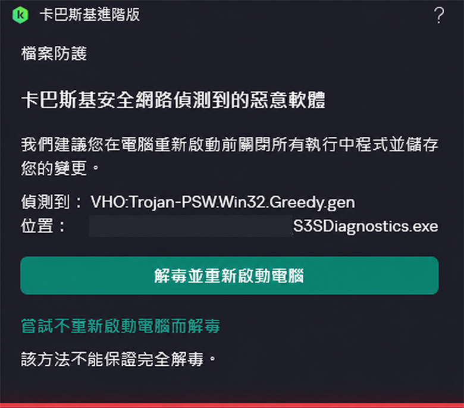

# 設定、備份與疑難排解

## 設定分類

### 一般

- 介面語言與一般應用程式偏好。

### 檔案與專案

- 預設專案資料夾。
- 收集專案媒體的輸出位置。
- YouTube 音訊下載位置。
- YouTube 音訊下載格式（從 2.1.0.0 起由原本的獨立區塊移入此頁）。
- 開啟資料夾或恢復預設路徑。

變更預設路徑不會自動搬移既有檔案。

### YouTube 下載格式（位於「檔案與專案」）

可選擇下載格式：

- 原始相容格式：保留來源品質並減少不必要轉碼。
- MP3：方便一般播放器使用，但會再次有損壓縮。
- WAV：適合後續編輯，但檔案較大，也無法恢復 YouTube 已失去的音質。

### 直播時間戳

包含 OBS WebSocket 功能說明、OBS 端啟用步驟、主機、連接埠、密碼及「連線」按鈕。這項設定主要用於直播時間戳，並非使用歌單或歌詞 Overlay 的必要條件。OBS 密碼屬於本機連線憑證，請勿公開分享包含密碼的設定畫面。

## 專案與媒體備份

`.bgmsproj` 保存專案資料，但本機音訊原檔仍可能位於其他資料夾。要搬到另一台電腦前，建議：

1. 儲存專案。
2. 使用收集專案媒體功能，將相關本機檔案集中到指定資料夾。
3. 備份 `.bgmsproj`、收集後的媒體及自行匯入的歌詞。
4. 在新電腦保持相對位置，或重新連結缺少的檔案。

## 程式無法啟動：Qt platform plugin

若看到「no Qt platform plugin could be initialized」：

<figure class="manual-figure manual-figure--small">
  
  <figcaption>這通常代表主程式和 Qt 外掛被分開、資料夾不完整，或直接從 ZIP 內啟動。</figcaption>
</figure>

1. 確認 ZIP 已完整解壓縮。
2. 從最外層 `Singing Stream Savior.exe` 啟動。
3. 不需要進入其他資料夾或嘗試開啟裡面的程式。
4. 如果仍然無法啟動，請刪除這份不完整的解壓縮結果，重新下載 ZIP 並再次完整解壓縮。
5. 需要桌面捷徑時，請替最外層的 `Singing Stream Savior.exe` 建立 Windows 捷徑，不要直接移動檔案。

## YouTube 無法解析或播放

- 確認網路連線。
- 確認連結是有效的 YouTube 影片或播放清單。
- 稍候後重試；YouTube 端變更可能暫時影響解析。
- 確認 `yt-dlp/ytdlp_helper.exe` 仍在程式資料夾中。

## 找不到歌詞

- 確認歌曲顯示歌名與歌手拼寫。
- 搜尋時可改用較短的關鍵字。
- 優先選擇標示為同步歌詞、且長度接近伴奏的結果。
- 若線上沒有合適版本，可匯入本機 LRC、SRT、VTT 或純文字。

## 歌詞時間不準

- 使用歌詞偏移進行 ±100 毫秒微調。
- 確認選到的歌詞版本長度接近伴奏。
- 現場版、剪輯版、升降 Key 版或前奏長度不同時，可能需要另外校正。

## 日文讀音不符合原曲

自動讀音無法完全理解所有人名、熟字訓、特殊語氣及歌手唱法。這不是歌詞時間錯誤，可關閉讀音或將它視為閱讀提示。

## OBS 畫面沒有更新

1. 在程式確認目前歌曲、待播或歌詞已更新。
2. 按「重新載入」更新程式內預覽。
3. 在 OBS 對 Browser Source 執行重新整理。
4. 確認 Browser Source 指向目前版本程式資料夾產生的本機頁面。
5. 若只是 WebSocket 紅燈，歌單 Overlay 仍可運作；WebSocket 主要影響直播時間戳。

## 防毒軟體警告與疑似誤判 {#antivirus-false-positive}

歌回救星目前由個人獨立開發，Windows 執行檔尚未提供可信任的程式碼簽章。部分防毒軟體可能因此依照啟發式特徵顯示警告；這不代表每一個警告都是惡意程式，但也不能反過來假設所有警告都是誤報。

開發者在自行建置與測試時，曾遇到以下兩次啟發式警告。當時的檔案來自開發者自己的建置環境，後續檢查未發現蒐集資料或惡意行為，因此判斷為疑似誤報。圖片中的本機路徑已遮蔽，只保留偵測名稱與檔名。

  <figure class="manual-figure">
    
    <figcaption>2026-08-06：本機建置的主程式被標示為 <code>PDM:Trojan.Win32.Generic</code>。</figcaption>
  </figure>
  <figure class="manual-figure">
    
    <figcaption>2026-08-10：內部 QA 工具 <code>S3SDiagnostics.exe</code> 被啟發式規則標示；這個工具不是公開下載包中的主程式。</figcaption>
  </figure>

看到警告時，建議依序確認：

1. 不要關閉防毒，也不要直接把整個程式資料夾加入白名單。
2. 確認 ZIP 只來自本說明網站或官方 GitHub Release。
3. 比對下載頁公布的版本、檔名與 ZIP SHA-256。
4. 若來源或雜湊不同，請停止執行並刪除檔案。
5. 若來源與雜湊相符，仍可先保留警告畫面、偵測名稱與 SHA-256，回報給開發者確認；如果仍有疑慮，請先不要下載或執行，等待未來提供可信任簽章的版本。

## 安全更新

平常從最外層的 `Singing Stream Savior.exe` 啟動時，Launcher 1.2 會先檢查更新。**沒有新版本時不會停在提示頁**，檢查完成便自動開啟目前安裝的主程式；離線或尚未到下一次檢查時間時，也會使用已驗證的目前版本，不必等待網路。

有新版本時，卡片式畫面會列出目前版本、目標版本與本次更新內容。按「稍後」或關閉這個詢問畫面，會直接開啟目前版本，不會改動檔案；按「立即更新」才會下載。

<figure class="manual-figure"><figcaption>更新內容在可捲動的卡片區顯示；「稍後」保留目前版本，「立即更新」才開始下載。</figcaption></figure>

下載期間可以按「取消」或關閉視窗要求安全取消。Launcher 會保留原本的 `current.json` 與已安裝檔案、清除未完成暫存，再啟動目前版本。進入不可中斷的最終交換階段後，關閉操作會暫時忽略，直到交易安全完成；即使在更新途中被強制結束或電腦重啟，下次啟動也會先依持久化交易紀錄完成回復或收尾，不會把新舊 DLL 混在同一個可啟動版本。

<figure class="manual-figure"><figcaption>套件會先核對 HTTPS 來源、檔案大小與 SHA-256，再以可回復的交易方式切換版本。</figcaption></figure>

請保留最外層的 `Singing Stream Savior.exe`、`current.json` 和內部資料夾原有的相對位置，不要只移動其中一個檔案。Launcher 會保留一份上一版的已驗證套件供自動修復與交易回復使用，但 1.2 不提供一鍵降版按鈕；舊版不一定能理解新版專案內容。若必須退回，請把官方舊版完整 ZIP 解壓到**另一個資料夾**，先複製 `.bgmsproj` 與媒體再測試，不要用舊版覆蓋新版資料夾。

若啟動器提示需要較新的啟動器，或自動更新仍無法完成，請改從本說明網站下載最新版完整 ZIP，解壓縮到新的資料夾，再用新版開啟原本的 `.bgmsproj`。不要把兩個版本的 DLL 直接混合覆蓋。

[上一頁：完整、精簡與迷你模式](workspace-modes.md) · [回到說明書首頁](README.md)
