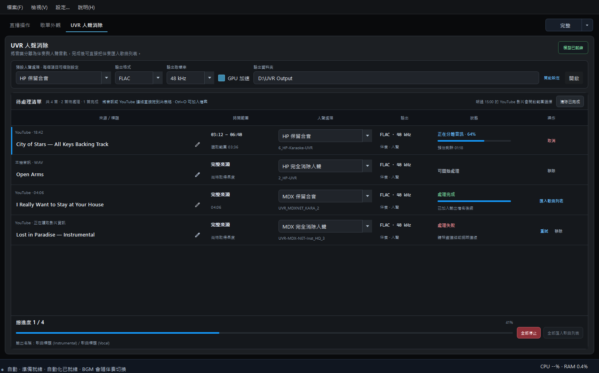

# UVR 人聲消除

## 為什麼加入人聲分離？

準備演唱或練習素材時，常常需要在不同工具之間轉檔、分離音軌，再重新整理檔案。我把這些操作整合進歌回救星，希望讓大家處理有權使用的素材時，少一點重複工作。

> **開始前，請確認素材的使用範圍。**
>
> 請使用您擁有相關權利、授權涵蓋音訊分離，或依法可利用的素材。購買音檔、能在網路上播放，或由其他人分享，均不當然表示可以分離、直播、上傳或散布。
>
> 本功能不提供歌曲授權。分離結果仍可能包含受保護的詞曲與錄音；公開使用前，請確認現有授權是否涵蓋預定用途。使用 YouTube 來源時，也須遵守適用的平台規範。

<section class="chapter-quick-start" aria-labelledby="uvr-quick-start">
  

    
2.1.1 新功能

    <h2 id="uvr-quick-start">四步完成音訊分離與匯入</h2>
    
選擇有權取得與處理的音訊來源，設定分離方式與輸出格式。完成後可直接將伴奏音軌加入歌曲列表，人聲與伴奏檔案則保留在輸出資料夾。

    <ol class="chapter-quick-start__steps">
      <li>
<strong>拖入待處理清單</strong>把一個或多個音訊檔，或 YouTube 影片連結，直接拖到表格。
</li>
      <li>
<strong>確認每首設定</strong>可逐首選擇 HP 或 MDX，以及保留合音或完全消除人聲；再選擇輸出格式與取樣率。
</li>
      <li>
<strong>開始處理</strong>按「開始處理」，從每首歌曲狀態與底部總進度查看進度；處理中可「全部停止」。
</li>
      <li>
<strong>匯入伴奏</strong>完成後逐首匯入，或等全部完成再按「全部匯入歌曲列表」。
</li>
    </ol>
    
<strong>完成時：</strong>歌曲列表只會加入實際伴奏；人聲與伴奏兩個輸出檔仍會保留在輸出資料夾。

  

  <figure class="manual-figure">
    
    <figcaption>2.1.2 介面示意：每首可使用不同模型，進度與操作會顯示在同一列。</figcaption>
  </figure>
</section>

## 加入待處理清單

把一個或多個本機音訊檔，或 YouTube 影片連結，直接拖到「待處理清單」即可。YouTube 會自動讀取影片標題；影片超過 15 分鐘時，會先詢問是否選取需要的播放範圍。

點歌名旁的鉛筆可編輯標題。2.1.2 新增 HP 模型，與 MDX 一樣可選「保留合音／完全消除人聲」，同一份清單可逐首使用不同模型。新安裝預設為 HP 保留合音；軟體會記住你選擇的預設設定。

按下「開始處理」後，這一批工作的設定會暫時鎖定。視窗最小化後仍會在背景處理，可隨時使用「全部停止」。

沐橙個人聽感推薦 HP，實測認為較能保留伴奏細節，但效果可能因歌曲或曲風而有差異，僅供參考。相同條件實測，HP 會比 MDX 慢，實際速度依歌曲與電腦而異。

## 輸出與 GPU

- 輸出格式可選 WAV、FLAC 或 MP3；MP3 使用 320 kbps。
- 取樣率預設為 **48 kHz**，也可改為 **44.1 kHz**。
- 勾選 GPU 加速後，軟體會使用相容的顯示卡處理；若無法使用 GPU，會自動改用 CPU，並在主視窗左下角說明原因。
- 輸出資料夾統一在「設定 > 檔案與專案」管理；UVR 頁面的「開啟設定」會直接帶到該位置。

## 處理與匯入

按「開始處理」後，清單會依序處理所有歌曲，並顯示每首歌曲與整批工作的進度。完成時會產生名稱帶有 `(Instrumental)` 與 `(Vocal)` 的兩個檔案。

「匯入歌曲列表」只會把實際的伴奏檔加入歌曲庫；人聲檔仍會保留在輸出資料夾。所有歌曲都完成後，也可以一次全部匯入。

  <figure class="manual-figure">
    
    <figcaption>全部處理完成後，可逐首匯入或使用「全部匯入歌曲列表」。</figcaption>
  </figure>
  <figure class="manual-figure">
    
    <figcaption>匯入完成後，主視窗左下角與清單狀態都會顯示結果。</figcaption>
  </figure>

> **已確認可用於直播的素材，建議提前完成處理。** 人聲分離會使用 CPU 或 GPU 資源；直播中執行前，請先確認電腦仍有足夠效能處理音訊與 OBS。

[上一頁：直播時間戳擷取](obs-websocket.md) · [下一頁：完整、精簡與迷你模式](workspace-modes.md)
