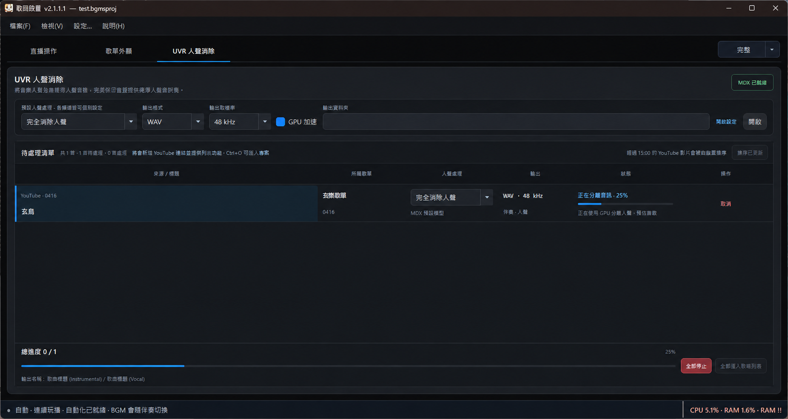
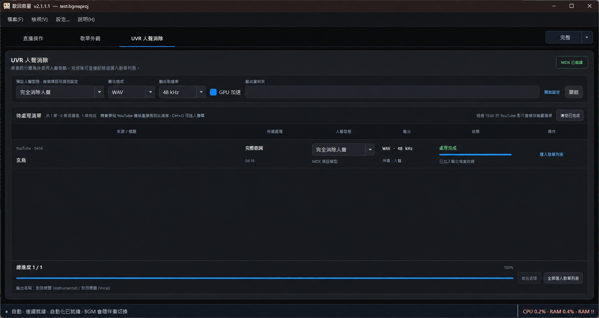
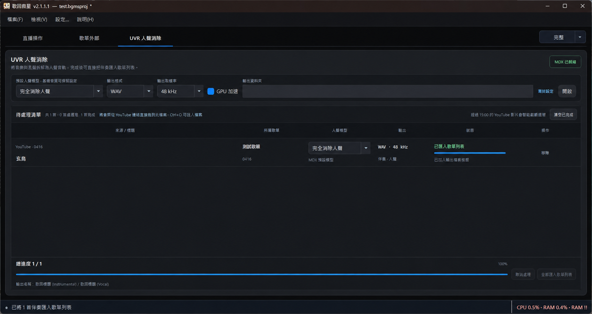

# UVR 人聲消除

<section class="release-preview-section uvr-guide" aria-labelledby="uvr-211-title">
  

    
2.1.1 新功能

    <h2 id="uvr-211-title">從音源到可演唱伴奏，在同一個頁面完成</h2>
    
UVR 會用 MDX 模型把音源分離成伴奏與人聲。完成後可直接把伴奏匯入歌曲列表，不必在多個工具之間來回整理檔案。

  

  

    <figure class="manual-figure release-preview-gallery__wide">
      
      <figcaption>單曲狀態與底部總進度會同步更新；處理中可隨時「全部停止」。</figcaption>
    </figure>
    <figure class="manual-figure">
      
      <figcaption>全部處理完成後，可逐首匯入或使用右下角的「全部匯入歌曲列表」。</figcaption>
    </figure>
    <figure class="manual-figure">
      
      <figcaption>匯入完成後，主視窗左下角會顯示結果；列表中的狀態也會改為「已匯入歌曲列表」。</figcaption>
    </figure>
  

</section>

## 加入待處理清單

把一個或多個本機音訊檔，或 YouTube 影片連結，直接拖到「待處理清單」即可。YouTube 會自動讀取影片標題；影片超過 15 分鐘時，會先詢問是否選取需要的播放範圍。

歌曲標題與「保留合音／完全消除人聲」可在開始前逐首調整。預設使用「保留合音」；按下「開始處理」後，這一批工作的設定會暫時鎖定，避免處理途中更換模型而讓結果不一致。

## 輸出與 GPU

- 輸出格式可選 WAV 或 FLAC。
- 取樣率預設為 **48 kHz**，也可改為 **44.1 kHz**。
- 勾選 GPU 加速後，軟體會使用相容的顯示卡處理；若無法使用 GPU，會自動改用 CPU，並在主視窗左下角說明原因。
- 輸出資料夾統一在「設定 > 檔案與專案」管理；UVR 頁面的「開啟設定」會直接帶到該位置。

## 處理與匯入

按「開始處理」後，清單會依序處理所有歌曲，並顯示每首歌曲與整批工作的進度。完成時會產生名稱帶有 `(Instrumental)` 與 `(Vocal)` 的兩個檔案。

「匯入歌曲列表」只會把實際的伴奏檔加入歌曲庫；人聲檔仍會保留在輸出資料夾。所有歌曲都完成後，也可以一次全部匯入。

> **建議在直播前先處理。** 人聲分離會使用 CPU 或 GPU 資源；直播中執行前，請先確認電腦仍有足夠效能處理音訊與 OBS。

[上一頁：直播時間戳擷取](obs-websocket.md) · [下一頁：完整、精簡與迷你模式](workspace-modes.md)
