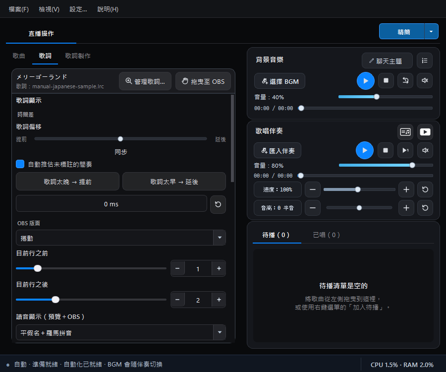
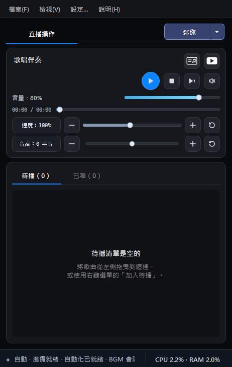
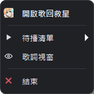

# 完整、精簡與迷你模式

右上角的模式按鈕可在三種工作空間之間切換。按主要按鈕會依序循環，右側下拉選單可直接選擇指定模式。

快捷鍵：`Ctrl + Shift + M`

<section class="chapter-quick-start" aria-labelledby="modes-quick-choice">
  

    
依現在的工作選模式

    <h2 id="modes-quick-choice">不用重新設定，隨時切換畫面大小</h2>
    
切換模式只會收起或顯示控制項；播放、待播順序與 OBS 畫面都不會重設。

    

      <a href="#full-mode"><strong>完整模式</strong>整理歌曲、歌詞、主題與直播設定</a>
      <a href="#compact-mode"><strong>精簡模式</strong>直播中仍需要選歌與調整內容</a>
      <a href="#mini-mode"><strong>迷你模式</strong>歌曲已排好，只保留播放與待播</a>
      <a href="#notification-area"><strong>系統通知區</strong>主視窗不用顯示，從右鍵選單控制</a>
    

    
<strong>切換方式：</strong>點右上角模式按鈕循環切換，或按右側倒三角形直接選擇。

  

  <figure class="manual-figure">
    
    <figcaption>完整模式適合直播前準備；直播中可再切換成精簡或迷你模式。</figcaption>
  </figure>
</section>

## 完整模式 {#full-mode}

適合準備直播與調整設定：

- 顯示完整歌曲資料與來源欄位。
- 顯示歌詞即時預覽。
- 顯示歌單外觀即時預覽與主題指南。
- 適合管理歌曲、封面、歌詞及 OBS 畫面。

## 精簡模式 {#compact-mode}

適合直播進行中、仍需要選歌與調整內容時：

- 保留歌曲庫、歌單、播放器、待播與已唱。
- 隱藏歌曲來源或檔名欄位。
- 隱藏大型內嵌預覽以節省寬度與繪製資源。
- 仍可切換到歌詞頁並開啟「歌詞視窗」。

<figure class="manual-figure manual-figure--medium">
  
  <figcaption>精簡模式保留歌曲庫與直播操作，同時縮小工作區寬度。</figcaption>
</figure>

## 迷你模式 {#mini-mode}

適合在開播前已完成待唱歌曲與畫面設定，並已將歌曲排入待播清單的主播。這個模式把畫面縮到最精簡，直播中只要從待播清單選擇下一首歌曲播放即可。

- 隱藏歌曲庫、歌單編輯及背景音樂播放器。
- 保留歌唱伴奏播放器，以及速度、音高和音量控制。
- 保留待播／已唱清單，方便依照預先安排的順序播放。
- 保留「歌詞視窗」按鈕。歌詞視窗可自由移動及調整文字大小，方便依照直播螢幕上的其他軟體自行安排位置。

從完整或精簡模式切換到迷你模式時，只會收起不常用的介面；正在播放的歌曲會繼續播放，原本的待播順序與 OBS 畫面也不會被重設。

<figure class="manual-figure manual-figure--portrait">
  
  <figcaption>迷你模式隱藏 BGM 與歌曲庫，把空間留給歌唱伴奏、待播和已唱清單；需要閱讀歌詞時可另外開啟「歌詞視窗」。</figcaption>
</figure>

## 縮到 Windows 系統通知區 {#notification-area}

如果直播時不需要保留主視窗，可在設定中讓關閉按鈕改為「縮到系統通知區」。程式與播放流程會繼續在背景執行；在工作列通知區對歌回救星圖示按右鍵，即可依目前狀態操作播放／暫停、停止、從頭播放、Key、速度、Profile、麥克風靜音／恢復、歌詞視窗與 Meter。選擇選單底部的「關閉軟體」才會完整結束程式。

<figure class="manual-figure manual-figure--medium">
  
  <figcaption>未播放時只顯示精簡項目；播放伴奏或開啟進階直播模式後，選單會依狀態增加播放、Key、速度、Profile、麥克風與 Meter 操作。</figcaption>
</figure>

## 視窗配置記憶

完整、精簡與迷你模式會分別記住視窗大小及相關分隔位置。切回原模式時會恢復先前配置。

## 使用建議

- **整理歌曲、歌詞與主題：** 完整模式。
- **直播中仍會臨時點歌：** 精簡模式。
- **曲目已排定，只需要播放與看待播：** 迷你模式。
- **不需要顯示主視窗，但仍要控制直播：** 縮到 Windows 系統通知區，使用右鍵選單或全域快捷鍵。
- **需要大字閱讀歌詞：** 開啟獨立歌詞視窗並移到適合的螢幕位置。

[上一頁：UVR 人聲消除](uvr-vocal-removal.md) · [下一頁：設定、備份與疑難排解](settings-and-troubleshooting.md)
